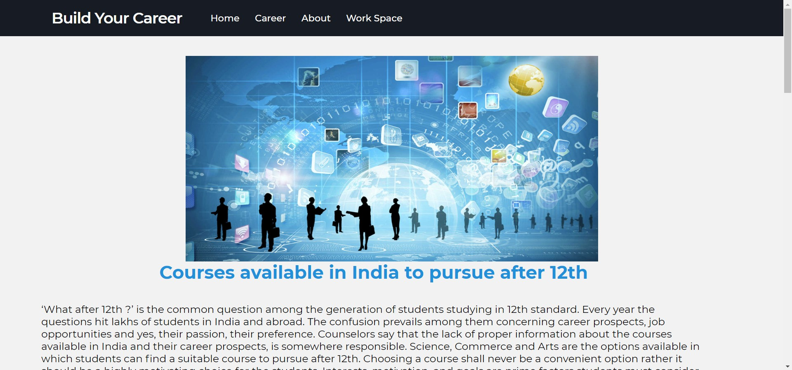
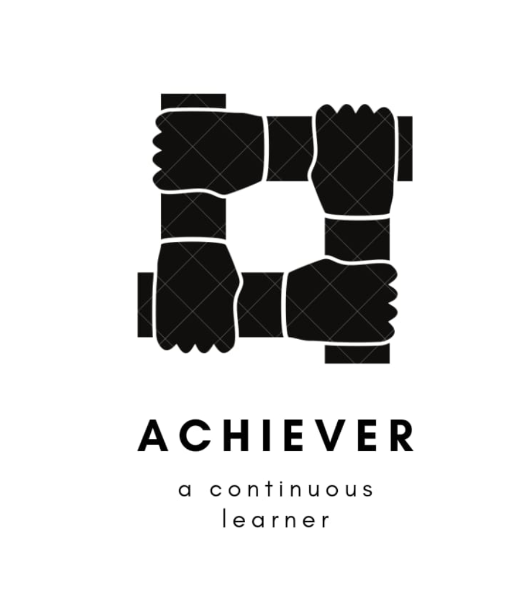

# buildyourcareer
**Visit** [build your career](https://buildyourcareer-achiever.web.app/index.html)

This is the First WEB DEV project done by ACHIEVER team.
This Project comes under "Progressive Work Division" Of ACHIEVER.
      
BUILD YOUR CAREER website is about career Guidance for Students.
It features a minimalized and detailed information about Courses that can a student pursue after his/her 12th grade.
It also features Workspace where Student utilize tools that can improve his/her task management.
      
Members involved in the Project : 

 **Vinay Vura** :
      
   worked on designing whole website and fetched information about the respective topic 
      and created the basic version of site, Nav bar is designed by him and both Home and career pages are done by him.
      
 **Vishal Garje** : 
      
  worked on workspace features. He built them with help of Javascript.
      
 **Karthikeya** :

  Also worked on Workspace features and worked on givings final repairs and add-ons to the Project 
       and finally hosted the site using Firebase.
      
   
   
   
   
   
  
  
  
  
  
 about **"ACHIEVER"** :
      
   It is a community for people who want to Recreate and Enhance themselves to get suitable for this competitive World.
          This gives a platform to who people lack resources and information. 
          This community believes in Work and Skills.
          Skill development is the main intention of our group.
      
   This team has 3 divisions :
   * **Technical Skills Development Division (TSDD)**
   * **NON-Technical Skills Development Division (NTSDD)**
   * **Progressive Work Division (PWD)**
   
   
   about **"Progressive Work Division"** :
      
   This is where all the implementation of skills will be done
          Like: Projects, minor Projects, Research and Development Activities etc..,
      
   Independent Work flow with individuality among projects.
   
   
   
   
   This team is currently led by :

  ### **KARTHIKEYA KANNAIAH**
   
   * Technical (TSDD) **HEAD**

  ### **VINAY VURA**
   
   * Visionary **HEAD** of team and Non-Technical (NTSDD) **HEAD**
